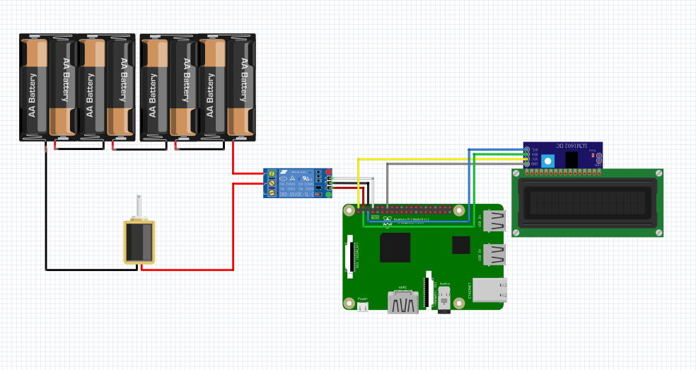

# IoT SmartDeliveryBox

A smart delivery box system that leverages IoT technology to enhance the delivery and pickup experience. It integrates electronic lock control and a web-based user interface to provide security and convenience.

## 📦 Key Features
1. **OTP Verification for Delivery Personnel** : Use a one-time password (OTP) for secure access.
2. **LCD Display for Delivery Personnel** : An LCD screen provides clearly instructions and feedback.
3. **Group Access Management** : Allowing multiple people to control the same box.
4. **Secure Lock Control** : Electronic lock supports control via the web interface.
5. **User-Friendly Operation** : Operated through a web-based interface.


## 🛠 Technical Details

### Hardware
- **Raspberry Pi**
- **[LY-03 DC12V電磁電控鎖](https://www.icshop.com.tw/products/368011000480)**
- **[1路5V繼電器模組](https://www.taiwaniot.com.tw/product/1%e8%b7%af%e7%b9%bc%e9%9b%bb%e5%99%a8%e6%a8%a1%e7%b5%84-5v%e4%bd%8e%e9%9b%bb%e5%b9%b3%e8%a7%b8%e7%99%bc-%e7%b9%bc%e9%9b%bb%e5%99%a8%e6%93%b4%e5%b1%95%e6%9d%bf-%e8%97%8d%e7%89%88/)**
- **[IIC/I2C 1602 LCD 藍色背光液晶模組](https://www.taiwaniot.com.tw/product/1602-%e8%97%8d%e5%ba%95%e7%99%bd%e5%ad%97-iici2c-6x2-%e8%83%8c%e5%85%89%e6%b6%b2%e6%99%b6%e6%a8%a1%e7%b5%84/)**
- **6V Battery Pack (Two packs connected in series to provide 12V)**

### Software
- **Development Frameworks**:
  - Flask: Web interface and API
  - Firebase: Data storage and Authentication
- **Platform**:
  - Web Interface
  - Raspberry Pi Server
 

### Workflow
1. **Package Delivery**:  
   Delivery personnel enters a One-Time Password (OTP) on the web interface or a dedicated app to unlock the box and place the package securely.  
   
2. **Real-Time Feedback**:  
   Instructions and box status are displayed on the LCD screen connected to the Raspberry Pi, providing immediate feedback during the delivery process.

3. **Remote Management**:  
   Users (customers) can remotely manage access permissions, monitor delivery status, and lock/unlock the box via the web interface.

4. **Shared Access**:  
   Authorized group members can access the box if granted specific permissions by the primary user.

5. **Hardware Integration**:  
   The Raspberry Pi server controls the hardware components, including the locking mechanism, relay, and LCD, ensuring seamless interaction between software and hardware.


## System Diagram


## 🚀 Installation and Usage

### Hardware Setup
1. Ensure Raspberry Pi is connected to the electronic lock and LCD screen.
2. Check for stable network connectivity.
   ### Circuit Diagram


### Software Installation
#### For Raspberry Pi
1. Clone the Raspberry Pi repository:
   ```bash
   git clone https://github.com/che0124/iot-SmartDeliveryBox-RaspberryPi.git
   ```
2. Install dependencies:
   ```bash
   cd Siot-SmartDeliveryBox-RaspberryPi
   pip install -r requirements.txt
   ```
3. Run the program:
   ```bash
   python app.py
   ```

#### For Web Server (Computer)
1. Clone the repository:
   ```bash
   git clone https://github.com/che0124/iot-final_proj.git
   ```
2. Install dependencies:
   ```bash
   cd iot-final_proj
   pip install -r requirements.txt
   ```
3. Start the server:
   ```bash
   python app.py
   ```
4. Open `http://localhost:5000` in a browser to access the interface.


## 📄 File Structure

```plaintext
SmartDeliveryBox/
├── app.py            # Main application entry point
├── requirements.txt  # Dependency requirements
├── templates/        # HTML files
├── static/           # Static resources (CSS, JS, Images)
└── README.md         # Documentation

SmartDeliveryBox-Pi/
├── pi_app.py         # Raspberry Pi application entry point
├── requirements.txt  # Dependency requirements
└── README.md         # Documentation
```

---

## 🛡 Security and Privacy
- All data transmission is encrypted to ensure user privacy.

---

## 🤝 Contributing
We welcome contributions from everyone:
1. Fork the repository.
2. Submit a Pull Request.
3. Provide feedback or report issues via [Issues](https://github.com/yourusername/SmartDeliveryBox/issues).

---

## 📧 Contact
For any questions or suggestions, please contact:
- Author: Zhe-Wei Kang
- Email: example@example.com

---

## 📜 License
This project is licensed under the [MIT License](https://opensource.org/licenses/MIT).
