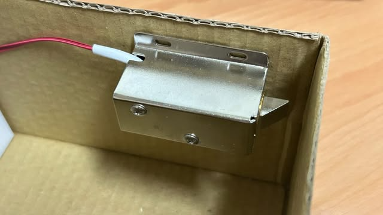
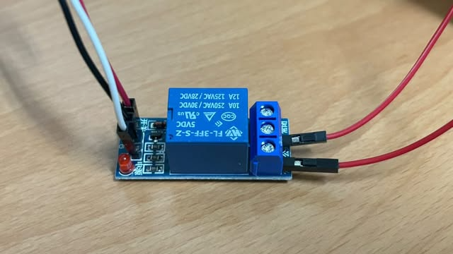
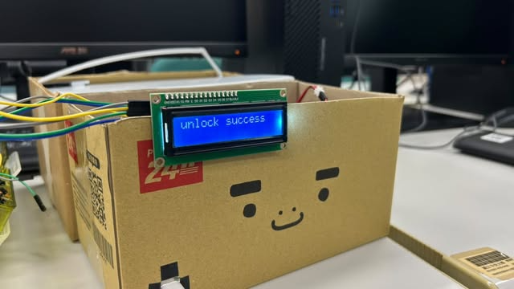

# IoT SmartDeliveryBox
A secure and intelligent delivery management system leveraging IoT technology to revolutionize the delivery experience. This solution combines electronic access control with a web-based interface to provide a seamless, secure platform for managing deliveries.

## 📊 System Architecture


## 🌟 Features
- **OTP Verification for Delivery Personnel** : Use a one-time password (OTP) for secure access.
- **LCD Display for Delivery Personnel** : An LCD screen provides clearly instructions and feedback.
- **Group Access Management** : Allowing multiple people to control the same box.
- **Secure Lock Control** : Electronic lock supports control via the web interface.
- **User-Friendly Operation** : Operated through a web-based interface.

## 🛠️ Workflow
1. **Food Delivery**:  
   Delivery personnel enters a One-Time Password (OTP) on the web interface or a dedicated app to unlock the box and place the food securely.  
   
2. **Real-Time Feedback**:  
   Instructions and box status are displayed on the LCD screen connected to the Raspberry Pi, providing immediate feedback during the delivery process.

3. **Remote Management**:  
   Users (customers) can remotely manage access permissions, monitor delivery status, and lock/unlock the box via the web interface.

4. **Shared Access**:  
   Authorized group members can access the box if granted specific permissions by the primary user.

5. **Hardware Integration**:  
   The Raspberry Pi server controls the hardware components, including the locking mechanism, relay, and LCD, ensuring seamless interaction between software and hardware.

## 📋 Components
Before beginning the installation, ensure you have the following:
### Hardware Requirements
- **Raspberry Pi**
- **[LY-03 DC12V Electronic Lock](https://www.icshop.com.tw/products/368011000480)**
- **[5V Single Channel Relay Module](https://www.taiwaniot.com.tw/product/1%e8%b7%af%e7%b9%bc%e9%9b%bb%e5%99%a8%e6%a8%a1%e7%b5%84-5v%e4%bd%8e%e9%9b%bb%e5%b9%b3%e8%a7%b8%e7%99%bc-%e7%b9%bc%e9%9b%bb%e5%99%a8%e6%93%b4%e5%b1%95%e6%9d%bf-%e8%97%8d%e7%89%88/)**
- **[I2C 1602 LCD Module with Blue Backlight](https://www.taiwaniot.com.tw/product/1602-%e8%97%8d%e5%ba%95%e7%99%bd%e5%ad%97-iici2c-6x2-%e8%83%8c%e5%85%89%e6%b6%b2%e6%99%b6%e6%a8%a1%e7%b5%84/)**
- **12V Power Supply (Two 6V battery packs in series)**

### Software Requirements
- **Raspbian Buster OS**
- **Firebase account with a configured project**
- **Python 3.x**
- **Libraries for web server**
   - Flask
   - firebase-admin 
   - pyotp
   - requests
- **Librarie for Raspberry Pi**
   - RPi.GPIO
   - RPLCD
   - smbus
   - Flask

## 🚀 Implementation

### 1. Setup Raspberry Pi
   - #### Step 1.1 : Follow the wesite below to set up your Raspberry Pi.<br>
      [https://www.raspberrypi.com/documentation/computers/getting-started.html](https://www.raspberrypi.com/documentation/computers/getting-started.html)
   - #### Step 1.2 : Enable Interfaces (SSH / I2C / VNC)
      - Open the Raspberry Pi Configuration tool from the Preferences menu in the desktop environment.
      - Navigate to the "Interfaces" tab and enable the following:
         - SSH
         - I2C
         - VNC
      - Click "OK" to save the changes.
   - #### Step 1.3 : Alternatively, you can enable via the command line:
      ```bash
      sudo raspi-config
      ```
      - Go to Interfacing Options and enable each interface as needed.
        
### 2. Hardware Setup
   - Circuit diagram
      
   - #### Step 2.1 : Power Supply Configuration
      - Use two 6V battery packs to provide power to the electronic lock and relay module:
         ```bash
        Battery Pack 1 (+) → Battery Pack 2 (-)
        Battery Pack 1 (-) → Lock Negative (-)
        Battery Pack 2 (+) → Relay NO (Normally Open)
         ```
        
   - #### Step 2.2 : Electronic Lock Wiring
      - Connect the wiring of the lock and fix it onto the box.
         ```bash
         Lock Positive (+) → Relay COM (Common)
         Lock Negative (-) → Battery Pack 1 (-)
         ```
         
        
   - #### Step 2.3 : Relay Module Connections
      - Connect the relay module to the Raspberry Pi GPIO pins as follows:
         ```bash
         VCC → Raspberry Pi 5V (Pin 4)
         GND → Raspberry Pi GND (Pin 6)
         IN  → Raspberry Pi GPIO14 (Pin 8)
         ```
        
        
   - #### Step 2.4 : LCD Module
      - Connect the LCD module to the Raspberry Pi GPIO pins as follows:
         ```bash
         VCC → Raspberry Pi 5V (Pin 2)
         GND → Raspberry Pi GND (Pin 14)
         SDA  → Raspberry Pi GPIO2 (Pin 3)
         SCL  → Raspberry Pi GPIO3 (Pin 5)
         ```
        

### 3. Software Installation
   - #### Step 3.2 : For Raspberry Pi
      - **Clone the Raspberry Pi repository**
         ```bash
         git clone https://github.com/che0124/SmartDeliveryBox-RaspberryPi.git
         ```
      - **Install dependencies**
         ```bash
         cd SmartDeliveryBox-RaspberryPi
         pip install -r requirements.txt
         ```
      - **Run the program**
         ```bash
         python app.py
         ```
     
   - #### Step 3.3 : For Web Server (Computer)
      - ##### Clone the repository
         ```bash
         git clone https://github.com/che0124/SmartDeliveryBox-IoT-final-proj.git
         ```
      - ##### Install dependencies
         ```bash
         cd SmartDeliveryBox-IoT-final-proj
         pip install -r requirements.txt
         ```
      - ##### Firebase Setup
         - **Create a Firebase Project**
            - Go to the [Firebase Console](https://firebase.google.com/) and log in with your Google account.
            - Click **Add Project**, enter a project name (e.g. SmartDeliveryBox), and follow the instructions to create the project.
         - **Add Firebase to Your App**
            - Copy the Firebase configuration code provided in the Firebase Console. It will look like this :
               ```javascript
               const firebaseConfig = {
                  apiKey: "YOUR_API_KEY",
                  authDomain: "YOUR_AUTH_DOMAIN",
                  projectId: "YOUR_PROJECT_ID",
                  storageBucket: "YOUR_STORAGE_BUCKET",
                  messagingSenderId: "YOUR_MESSAGING_SENDER_ID",
                  appId: "YOUR_APP_ID"
               };
               ```
            - Open the `firebase.js` and `auth.js` file in the project
            - Paste the copied Firebase configuration code into the file, replacing the placeholder values (`YOUR_API_KEY`, `YOUR_AUTH_DOMAIN`, etc.) with the actual values from your Firebase Console.
         - **Firebase Admin SDK Setup**
            - Enable Firebase Admin SDK
               - Select your project and navigate to **Project Settings** > **Service Accounts** tab.
               - Click **Generate New Private Key** to download a JSON file containing your private key (e.g., `smart-delivery-box-firebase-adminsdk.json`).
               - Save this file securely in your project folder.
            - Integrate Firebase Admin SDK
               - Open the `app.py` file in your project.
               - Locate the existing Firebase Admin SDK initialization code.
               - Replace the JSON file name `project-name-firebase-adminsdk.json` with the name of the file you just saved (e.g. `smart-delivery-box-firebase-adminsdk.json`).<br>
                 Example :
                  ```python
                  # Initialize Firebase Admin SDK with the service account key
                  from firebase_admin import credentials, initialize_app
                  
                  cred = credentials.Certificate('smart-delivery-box-firebase-adminsdk.json')
                  initialize_app(cred)
                  ```
     
      - **Start the server**
         ```bash
         python app.py
         ```
      - **Open `http://localhost:5000` in a browser to access the interface**


## 📄 File Structure

```plaintext
SmartDeliveryBox-RaspberryPi/
├── lcd_show.py       # LCD control 
├── lock_control.py   # Lock control 
├── app.py            # Raspberry Pi application entry point
├── requirements.txt  # Dependency requirements
└── README.md         # Documentation

SmartDeliveryBox-IoT-final-proj/
├── templates/        # HTML files
├── static/           # Static resources (CSS, JS, Images)
├── app.py            # Main application entry point
├── requirements.txt  # Dependency requirements
└── README.md         # Documentation
```


## 🎞️ [Demo Video](https://youtu.be/gzkcJCA_JWo)


## 📜 References
- [Getting started with your Raspberry Pi](https://www.raspberrypi.com/documentation/computers/getting-started.html)
- [Connecting to Raspberry Pi with RealVNC](https://www.youtube.com/watch?v=8bwbbG1mCzs&t=176s)
- [Firebase Authentication](https://www.letswrite.tw/firebase-auth-email/)
- [I2C連接LCD1602顯示日期時間](https://atceiling.blogspot.com/2019/10/raspberry-pi-53i2clcd1620.html)
- [Relay Module + Solenoid Door lock How to control them](https://www.youtube.com/watch?v=wGU04jtHC9w)
 

## ✉️ Contact
For any questions or suggestions, please contact:
- Author: Joseph Kang
- Email: joseph7492748@gmail.com
